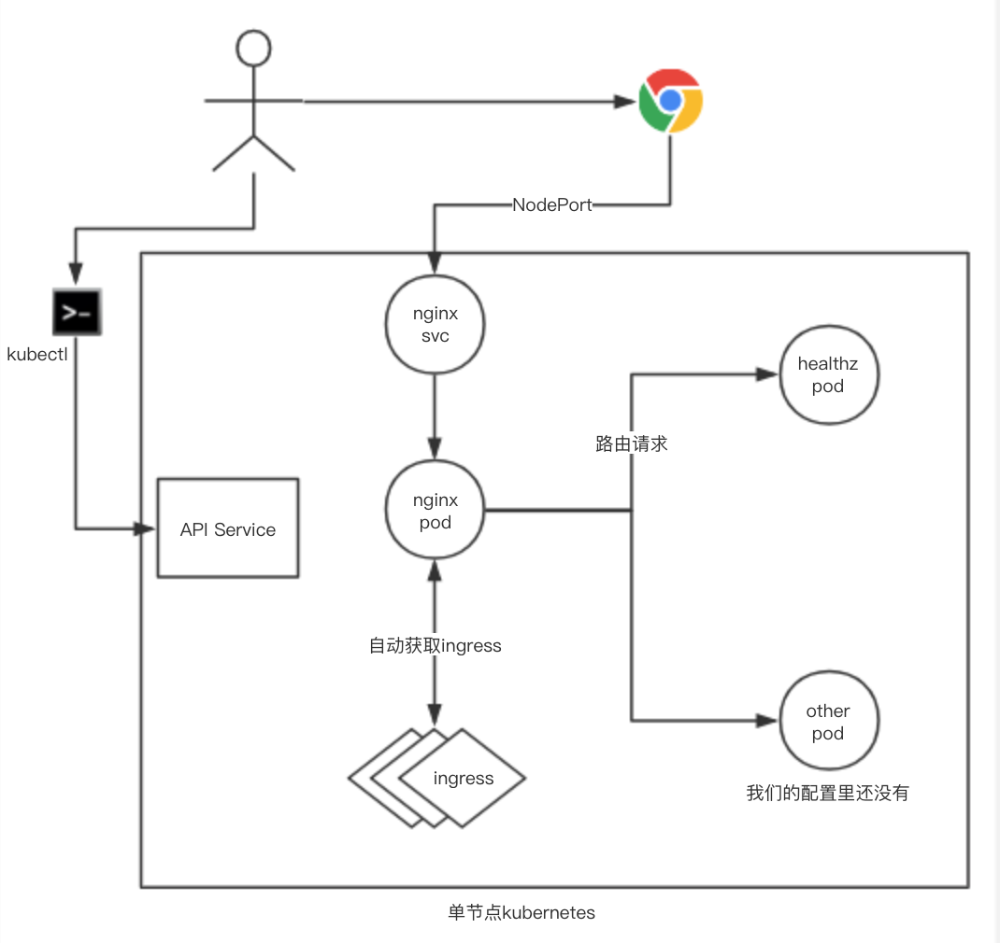

# kubernetes_helper

安装kubernetes的脚本

## Ubuntu16.04 单机安装 安装
+ 操作系统:Ubuntu16.04
+ 硬件配置:2核4GB阿里云ECS
+ 权限: root
+ 部署架构图

### 安装步骤
0. 准备环境
    + 准备一台Ubuntu16.04 机器，比如阿里云ECS 2核心8GB的机器，需要又公网IP
    + 配置一个kubectl访问集群用的域名，例如 k8s.xxxx.com,域名指向机器的公网IP
    + 配置一个API访问的域名，例如 api.xxxx.com,域名指向机器的公网IP
    + 确保机器的80,6443端口可以访问(阿里云机器的话需要配置安全组)
1. 安装git,下载本代码仓库
```
apt-get update -y && apt-get upgrade -y && apt install git
git clone https://github.com/gomode/kubernetes_helper.git
```

1. 执行安装脚本
```
cd kubernetes_helper/setup/
./setup_k8s_ubuntu_1604.sh
```
执行过程中需要如如两个参数:
    + 请输入想要安装的k8s版本(1.13.1),默认1.13.1，如果想要自定义，按照格式输入即可，否则直接回车
    + 请输入远程访问k8s需要的域名/公网IP，最好自己输入一个域名，然后把域名指向本机公网IP即可，也可以直接输入gongwangIP
      - 这个地址是后面从其他机器通过kubectl的地址
      — 到时候修改.kube/config下面的 server地址即可
    + 请输入访问集群测试API接口的域名，这个是用于测试集群内服务是否部署成功的
      - 这个域名通常配置为整个后端的接口域名
      - 整个脚本执行完成以后可以通过域名/healthz来测试，成功的话返回ok。

1. 测试服务可用性
   + 使用前面的api.xxxx.com/healthz，部署成功的话会返回ok
   + 前面的脚本会自动部署一个服务叫healthz，用于测试服务的可用性
        + 服务是一个go语言实现的http服务端
        + 代码再healthz目录中
        + 代码以Deployment的形式部署，暴露的端口是8080
        + 通过kubernetes的svc来暴露服务，服务端口80
        + 通过ingress-nginx来配置路由
1. 从公网使用kubectl访问集群(可选)
   + 本地安装好kubectl (具体安装文档:https://kubernetes.io/docs/tasks/tools/install-kubectl/)
   + 把集群服务器的~/.kube/config 下面的文件拷贝到本地的 ~/.kube/config 位置
   + 修改server 这个参数里面的私有地址替换为一开始准备好的域名(k8s.xxxx.com)
   + kubectl get node 查看一下

# 问题排查

1. kubectl 命令行自动提示
```
source <(kubectl completion bash)
```

1. kubelet日志查看
```
journalctl -f -u kubelet
```

1. 解决vim中文乱码问题
```
echo "set fileencodings=utf-8,gbk,utf-16le,cp1252,iso-8859-15,ucs-bom" >> /etc/vim/vimrc
echo "set set termencoding=utf-8" >> /etc/vim/vimrc
echo "set set encoding=utf-8" >> /etc/vim/vimrc
```


